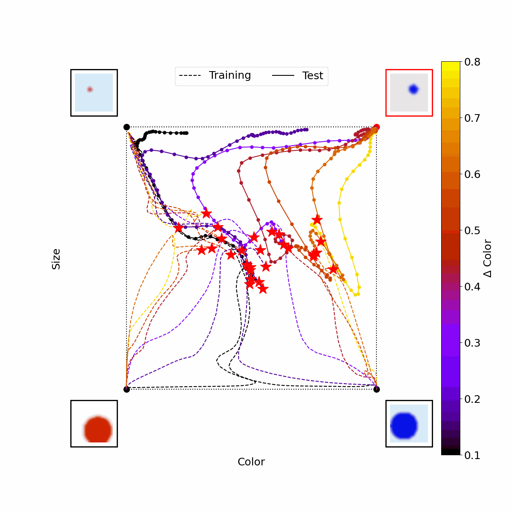

# Emergence of Hidden Capabilities: Exploring Learning Dynamics in Concept Space

Core Francisco Park\*, Maya Okawa\*, Andrew Lee, Ekdeep Singh Lubana†, Hidenori Tanaka†

Contact: corefranciscopark[at]g.harvard.edu, cfpark00[at]gmail.com

Paper: [Arxiv](https://arxiv.org/abs/2406.19370)

ICML 2024 Workshop on High Dimensional Learning Dynamics [Poster](https://docs.google.com/presentation/d/1or-UmVZd6MoCOllnu30rZDcmiu5WfH76GdpBpDWRl9E/edit?usp=sharing)

---

### Concept Space Generalization dynamics

### Elicitation of Hidden capability
